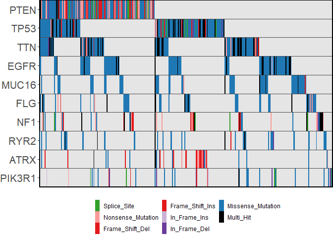

<!-- README.md is generated from README.Rmd. Please edit that file -->

# ggoncoplot

<!-- badges: start -->

[](https://lifecycle.r-lib.org/articles/stages.html#experimental)
[](https://CRAN.R-project.org/package=ggoncoplot)

<!-- badges: end -->

**ggoncoplot** creates interactive oncoplots from mutation level
datasets

## Installation

You can install the development version of ggoncoplot like so:

``` r
remotes::install_github('selkamand/ggoncoplot')
```

## Usage

### Input

The input for ggoncoplot is a data.frame with 1 row per mutation in
cohort and columns describing the following:

-   Gene Symbol

-   Sample Identifier

-   (optional) mutation type

-   (optional) tooltip (character string: what we show on mouse hover
    over a particular mutation)

These columns can be in any order, and named anything. You define the
mapping of your input dataset columns to the required features in the
call to **ggoncoplot**

``` r
library(dplyr)
#> 
#> Attaching package: 'dplyr'
#> The following objects are masked from 'package:stats':
#> 
#>     filter, lag
#> The following objects are masked from 'package:base':
#> 
#>     intersect, setdiff, setequal, union
library(ggoncoplot)

# TCGA GBM dataset from TCGAmuations package
gbm_csv <- system.file(package='ggoncoplot', "testdata/GBM_tcgamutations_mc3_maf.csv.gz")
gbm_df <- read.csv(file = gbm_csv, header=TRUE)

gbm_df |> 
  ggoncoplot(
    col_genes = 'Hugo_Symbol', 
    col_samples = 'Tumor_Sample_Barcode', 
    col_mutation_type = 'Variant_Classification', 
    topn = 5, 
    interactive = FALSE
  )
```



## Tooltip Customisation

Lets add a custom tooltip that descrones the specific mutation

``` r
gbm_df |> 
  mutate(tooltip = paste0(Reference_Allele, ">", Tumor_Seq_Allele2)) |>
  ggoncoplot(
    col_genes = 'Hugo_Symbol', 
    col_samples = 'Tumor_Sample_Barcode', 
    col_mutation_type = 'Variant_Classification', 
    col_tooltip = 'tooltip', # We'll specify a custom tooltip based on our new 'tooltip' column
    topn = 10, 
    interactive = FALSE
  )
```


Note tooltips are html, so if you want to insert a break, just paste in
`<br>`.

Similarly, if you want to make text in the tooltip bold, try
`"<b>text_to_bold<\b>"`
