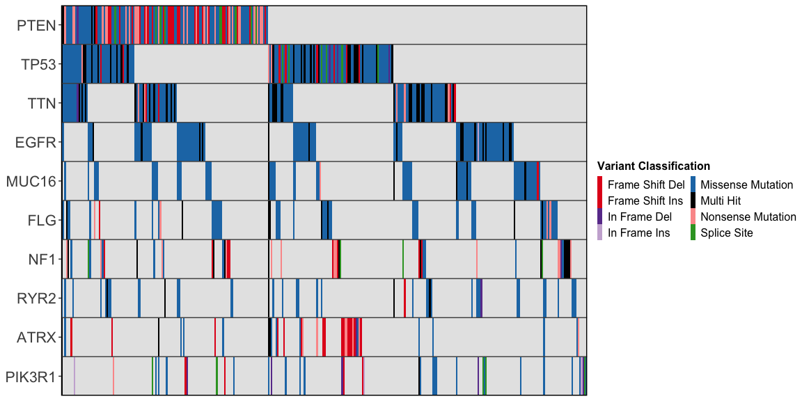

<!-- README.md is generated from README.Rmd. Please edit that file -->

# ggoncoplot <a href="https://selkamand.github.io/ggoncoplot/"></a>

<!-- badges: start -->

[](https://lifecycle.r-lib.org/articles/stages.html#experimental)
[](https://CRAN.R-project.org/package=ggoncoplot)
[](https://app.codecov.io/gh/selkamand/ggoncoplot?branch=master)
[](https://github.com/selkamand/ggoncoplot/actions/workflows/R-CMD-check.yaml)

[](https://github.com/selkamand/ggoncoplot)


<!-- badges: end -->

The **ggoncoplot** R package generates interactive oncoplots to
visualize mutational patterns across patient cancer cohorts.

## Installation

You can install the development version of ggoncoplot like so:

``` r
remotes::install_github('selkamand/ggoncoplot')
```

## Usage

For complete usage, see
[manual](https://selkamand.github.io/ggoncoplot/articles/manual.html)

### Input

The input for ggoncoplot is a data.frame with 1 row per mutation in
cohort and columns describing the following:

- Gene Symbol

- Sample Identifier

- (optional) mutation type

- (optional) tooltip (character string: what we show on mouse hover over
  a particular mutation)

These columns can be in any order, and named anything. You define the
mapping of your input dataset columns to the required features in the
call to **ggoncoplot**

### Basic Example

``` r
library(ggoncoplot)

# TCGA GBM dataset from TCGAmuations package
gbm_csv <- system.file(package='ggoncoplot', "testdata/GBM_tcgamutations_mc3_maf.csv.gz")
gbm_df <- read.csv(file = gbm_csv, header=TRUE)

gbm_df |> 
  ggoncoplot(
    col_genes = 'Hugo_Symbol', 
    col_samples = 'Tumor_Sample_Barcode', 
    col_mutation_type = 'Variant_Classification', 
    topn = 10, 
    interactive = FALSE
  )
#> 
#> ── Identify Class ──
#> 
#> ℹ Found 7 unique mutation types in input set
#> ℹ 0/7 mutation types were valid PAVE terms
#> ℹ 0/7 mutation types were valid SO terms
#> ℹ 7/7 mutation types were valid MAF terms
#> ✔ Mutation Types are described using valid MAF terms ... using MAF palete
```



### Add marginal plots

``` r
gbm_df |> 
  ggoncoplot(
    col_genes = 'Hugo_Symbol', 
    col_samples = 'Tumor_Sample_Barcode', 
    col_mutation_type = 'Variant_Classification', 
    topn = 10, 
    draw_gene_barplot = TRUE, 
    draw_tmb_barplot = TRUE,
    interactive = FALSE
  )
#> 
#> ── Identify Class ──
#> 
#> ℹ Found 7 unique mutation types in input set
#> ℹ 0/7 mutation types were valid PAVE terms
#> ℹ 0/7 mutation types were valid SO terms
#> ℹ 7/7 mutation types were valid MAF terms
#> ✔ Mutation Types are described using valid MAF terms ... using MAF palete
#> ! TMB plot: Ignoring `col_mutation_type` since `log10_transform = TRUE`.
#> This is because you cannot accurately plot stacked bars on a logarithmic scale
```


### Add clinical metadata

``` r
gbm_clinical_csv <- system.file(package = "ggoncoplot", "testdata/GBM_tcgamutations_mc3_clinical.csv")
gbm_clinical_df <- read.csv(file = gbm_clinical_csv, header = TRUE)

gbm_df |> 
  ggoncoplot(
   col_genes = "Hugo_Symbol",
   col_samples = "Tumor_Sample_Barcode",
   col_mutation_type = "Variant_Classification",
   metadata = gbm_clinical_df,
   cols_to_plot_metadata = c('gender', 'histological_type', 'prior_glioma', 'tumor_tissue_site'),
   draw_tmb_barplot = TRUE, 
   draw_gene_barplot = TRUE, 
   show_all_samples = TRUE,
   interactive = FALSE
  )
#> ℹ 2 samples with metadata have no mutations. Fitering these out
#> ℹ To keep these samples, set `metadata_require_mutations = FALSE`. To view them in the oncoplot ensure you additionally set `show_all_samples = TRUE`
#> → TCGA-06-0165-01
#> → TCGA-06-0167-01
#> 
#> ── Identify Class ──
#> 
#> ℹ Found 7 unique mutation types in input set
#> ℹ 0/7 mutation types were valid PAVE terms
#> ℹ 0/7 mutation types were valid SO terms
#> ℹ 7/7 mutation types were valid MAF terms
#> ✔ Mutation Types are described using valid MAF terms ... using MAF palete
#> ! TMB plot: Ignoring `col_mutation_type` since `log10_transform = TRUE`.
#> This is because you cannot accurately plot stacked bars on a logarithmic scale
#> 
#> ── Plotting Sample Metadata ────────────────────────────────────────────────────
#> 
#> ── Sorting
#> ℹ Sorting X axis by: Order of appearance
#> 
#> ── Generating Plot
#> ℹ Found 4 plottable columns in data
```


## Statement of Need

Oncoplots are highly effective for visualising mutation data in cancer
cohorts but are challenging to generate with the major R plotting
systems (base, lattice, or ggplot2) due to their algorithmic and
graphical complexity. Simplifying the process of generating oncoplots
would make them more accessible to researchers. Existing packages
including [ComplexHeatmap](https://github.com/jokergoo/ComplexHeatmap),
[maftools](https://github.com/PoisonAlien/maftools), and
[genVisR](https://github.com/griffithlab/GenVisR) all make static
oncoplots easier to create, but there is still a significant unmet need
for a user-friendly method of creating oncoplots with the following
features:

- **Interactive plots**: Customizable tooltips, cross-selection of
  samples across different plots, and auto-copying of sample identifiers
  on click. This enables exploration of multiomic datasets.

- **Support for tidy datasets**: Compatibility with tidy, tabular
  mutation-level formats (MAF files or relational databases), typical of
  cancer cohort datasets. This greatly improves the range of datasets
  that can be quickly and easily visualised in an oncoplot.

- **Auto-colouring**: Automatic selection of accessible colour palettes
  for datasets where the consequence annotations are aligned with
  standard variant effect dictionaries (PAVE, SO, or MAF).

- **Versatility**: The ability to visualize entities other than gene
  mutations, such as noncoding features (e.g., promoter or enhancer
  mutations) and non-genomic entities (e.g., microbial presence in
  microbiome datasets).

We developed ggoncoplot as the first R package to address all these
challenges together (). Examples of all key features are available in
the [ggoncoplot
manual](https://selkamand.github.io/ggoncoplot/articles/manual.html).

A full comparison of ggoncoplot features with similar tools is available
[here](paper/ggoncoplot_comparison.pdf)

## Acknowledgements

We acknowledge the developers and contributors whose packages and
efforts were integral to the development of ggoncoplot:

- **David Gohel** for the `ggiraph` package, which enables the
  interactivity of ggoncoplot.
- **Thomas Lin Pedersen** for his contributions to the `patchwork`
  package and the maintenance of `ggplot2`.
- **Hadley Wickham** and all contributors to the `ggplot2` package,
  which provides a robust foundation for data visualization in R.

Additionally, we thank **Dr. Marion Mateos** for her insightful feedback
during the early stages of ggoncoplot development.

## Community Contributions

All types of contributions are encouraged and valued. See our [guide to
community contributions](CONTRIBUTING.md) for different ways to help.
