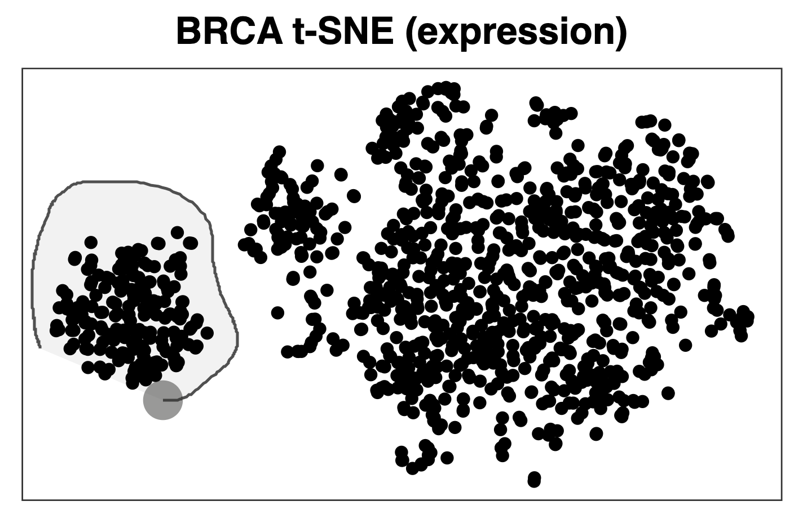

# Summary

The ggoncoplot R package generates interactive oncoplots (also called oncoprints) to visualize mutational patterns across patient cancer cohort (\autoref{fig:oncoplot}). These plots reveal patterns of gene co-mutation and include marginal plots that indicate co-occurrence of gene mutations and tumour features.  It is useful to relate gene mutation patterns seen in an oncoplot to patterns seen in other data plot types, e.g., viewing selected patient subgroups in gene expression t-SNE plots or methylation UMAPs. There are, however, no existing oncoplot-generating R packages that support such dynamic data linkage between different plots. To addresses this gap and enable rapid exploration of a variety of related data types we constructed the ggoncoplot package for the production of oncoplots that are easily integrated with custom visualisations and that support synchronised data-selections across plots (\autoref{fig:multimodal_selection}). ggoncoplot is available on GitHub at <https://github.com/selkamand/ggoncoplot>.

![ggoncoplot output visualising mutational trends in the TCGA breast carcinoma cohort. Individual patient samples are plotted on the x-axis, ordered by ggoncoplot. The plot indicates (y-axis, sorted by genes mutation frequency) that PIK3CA is the most frequently mutated gene, followed by TP53. Marginal plots indicate the total number of mutations per sample (top), and the number of samples showing mutations in each gene, coloured by mutation type (right). A range of clinical features, including progesterone and estrogen receptor status are shown on the marginal plot at the bottom. \label{fig:oncoplot}](oncoplot.pdf)

![Example of a ggoncoplot using the plots shown in Figure 1, where the oncoplot has been dynamically cross-linked to a gene expression t-SNE plot (top left) and a methylation UMAP plot (top right). Here, the lasso tool (see \autoref{fig:lasso_select}) was used to select a cluster of a gene expression data points (i.e., cohort individual samples) in the t-SNE plot. This resulted in the highlighting of the same samples on the UMAP and oncoplots. This reveals that the cluster on the left of the t-SNE plot also cluster in the oncoplot, chiefly in samples with mutations in TP53 but wild type PIK3CA.The plots of progesterone, estrogen, HER2 status and triple negative classification show that the samples selected in the t-SNE are all virtually all triple negative breast cancers.  In contrast to the oncoplot, the methylation UMAP shows no strong clustering, in line with knowledge of methylation patterns in triple negative breast cancer \label{fig:multimodal_selection}](multimodal_selection.png)

{height="600px"}

# Statement of Need

Oncoplots are highly effectively for visualising cohort-level mutation but are challenging to generate with the major R plotting systems (base, lattice, or ggplot2) due to their algorithmic and graphical complexity. Simplifying the process would make oncoplots more accessible to researchers. Packages like ComplexHeatmap [@Gu:2022], maftools [@Mayakonda:2018], and genVisR [@Skidmore:2016] all make static oncoplots easier to create, but there is still a significant unmet need for an easy method to create oncoplots with the following features:

-	**Interactive plots**: Customizable tooltips, cross-selection of samples across different plots, and auto-copying of sample identifiers on click.

-	**Support for tidy datasets**: Compatibility with tidy, tabular mutation-level formats (MAF files or relational databases), typical of cancer cohort datasets.

-	**Auto colouring**: Automatic selection of color palettes for datasets where consequence annotations are aligned with standard variant effect dictionaries (PAVE, SO, or MAF).

- **Versatility**: The ability to visualize entities beyond gene mutations, including noncoding features (e.g., enhancers) and non-genomic entities (e.g., microbial presence in microbiome datasets). 

We developed ggoncoplot as the first R package that addresses all these challenges simultaneously (\autoref{fig:comparison}). Examples of all key features are available in the [ggoncoplot manual](https://selkamand.github.io/ggoncoplot/articles/manual.html).

![Comparison of R packages for creating oncoplots. ^1^Requires the shiny and interactiveComplexHeatmap packages. ^2^Requires the user to first summarise mutations at the gene level as a sample by gene character matrix with mutations separated by semicolons (wide format). ^3^For MAF inputs the most severe consequence is chosen, however for non-MAF datasets users must manually define the mutation impact hierarchy. ^4^Non-unique mutation types are treated as one observation, however if different mutation types affect one gene, the indiviual mutations can be plotted with different shapes/configurations in a user-configured manner. \label{fig:comparison}](ggoncoplot_comparision.pdf)

# Acknowledgements

We thank the developers of the packages integral to ggoncoplot, especially David Gohel for ggiraph [@gohel:2024], which enables its interactivity, and Thomas Lin Pedersen for patchwork [@pedersen:2024] and ggplot2 maintenance. We also acknowledge Hadley Wickham and all contributors to ggplot2 [@wickham:2016]. 
Additionally, we thank Dr. Marion Mateos for her insightful feedback during the development of ggoncoplot.

# References
